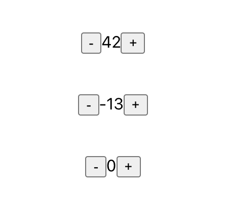

# React Class Based Counter



- Resource: https://learn.digitalcrafts.com/flex/lessons/full-stack-frameworks/stateful-components/#passing-helper-methods-as-props

```jsx
// check if handleIncrementClick fx is working by console out
class App extends Component {

  handleIncrementClick() {
    console.log('increment clicked');
  }

  render() {
    return (
      <div>
        <h1>0</h1>
        <button onClick={this.handleIncrementClick}>Increment</button>
      </div>
    );
  }
}
```

- this.bind to have this not being undefined:

```jsx
class App extends Component {
  constructor() {
    // this keyword is defined inside of constructor function only.
    super(); // call parent constructor, Component, https://youtu.be/s7UzFzD4zZI?t=275
    // counter prop is available to every Obj, every instance of App class
    console.log('[Constructor] this:', this) // this keyword is defined points at APP component.
    this.counter = 0;
  }

  handleIncrementClick() {
    // this keyword is not defined
    //  inside of class function.
    console.log('this', this); 
 
    // this.counter++;
    // console.log(this.counter);
  }

  render() {
    return (
      <div>
        <h1>0</h1>
        <button onClick={this.handleIncrementClick}>Increment</button>
      </div>
    );
  }
}

export default App;
```

- Fix undefined this keyword
// inside of constructor() we `.bind(this)` to the class function
`this.handleIncrementClick = this.handleIncrementClick.bind(this)`

```jsx
class App extends Component {
  constructor() {
    super();  // calling parent constructor, Component
    console.log('[Constructor] this:', this);
    this.counter = 0;

    this.handleIncrementClick = this.handleIncrementClick.bind(this);
  }

  // define function inside of class
  handleIncrementClick() {
    console.log('this', this); // this now points to App Component
    // this.counter++;
    console.log('this.counter', this.counter);  // => 0, initial value defined in constructor
  }
}

```

* OR option 2 (not use .bind()) Use Arrow Function: (TypeError: Cannot read property 'counter' of undefined)
  - Arrow function knows the context of `this` keyword (App its container)

```jsx
// convert class function into arrow function, 
handleIncrementClick = () => {
  console.log('this', this);
  // this.counter++;
  console.log('this.counter', this.counter); // this.counter is zero as initial value is defined inside of constructor
}

```

- UI bug:  UI only get updated first time component is mounted.
    * `render() {}` is called only once. 

- Fix UI bug: `this.state` to update whenever there is update in state.
  * Do not mutate state directly. Use setState()  react/no-direct-mutation-state
  * You never *change* state but you *replace* the state.

## functional component

```jsx
import React, { useState } from "react";

const LifecycleDemo = (props) => {
  console.log('render()');

  const [count, setCount] = useState(0);

  const _increment = () => setCount(count + 1);

    return (
      <>
        <h1>Lifecycle Demo {count}</h1>
        <button onClick={_increment}>+</button>
      </>
    );

}

export default LifecycleDemo;
```

- react knows that if you return a function from the callback, it should call the function to do "clean up".  Passing the empty Array ensures that the clean up function will only run once (when the Component is unmounting/removed)

```js
  // componentWillUnmount()
  useEffect(() => {
    return () => {
      console.log("Runs when component is unmounted/removed");
    }
  }, []);
```

## useEffect for API call 
- my demo api:
https://api.chucknorris.io/jokes/search?query=Tesla

```js

  // warning! async doesn't work here.  Effect cb are synchronous to prevent race conditions.
  useEffect(async () => {
    const someAPI = "https://api.chucknorris.io/jokes/search?query=Tesla";
    const val = await fetch(someAPI).then(res => res.json()).then(data => data.result[0].value);
    console.log(`API returned: ${val}`);
  });

  // fix - define async inside of useEffect() then call it inside of useEffect()
  useEffect(() => {
    const someAPIUrl = "https://api.chucknorris.io/jokes/search?query=Tesla";
    const asyncFn = async () => {
      const val = await fetch(someAPIUrl).then(res => res.json()).then(data => data.result[0].value);
      
      console.log(`API returned: ${val}`);
    }
    asyncFn();
  });
```

Thi